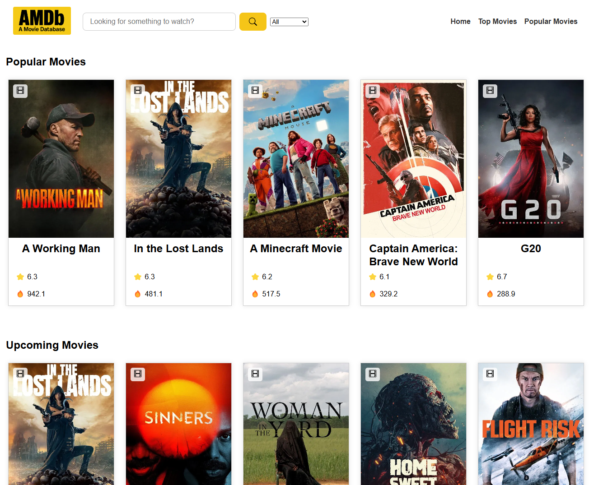

# 🎬 AMDb – A Movie Database

En förenklad IMDb-klon byggd med HTML, CSS och JavaScript som använder [The Movie Database (TMDB) API](https://www.themoviedb.org/documentation/api).

Användaren kan söka efter filmer, serier och skådespelare, visa detaljer och se trailers.

## 🔍 Förhandsvisning

📸 Så här ser startsidan ut:


## 🚀 Demo

[](https://olikal.github.io/java24-js-slutprojekt-oliver-kalthoff/)

## 🛠 Funktioner

- Sökning på film, tv-serie och person
- Filtrering och sortering av resultat (A–Z, Popularitet)
- Detaljsidor för filmer/serier med trailer, overview och cast
- Detaljsidor för personer med kort info och “known for”
- Populära filmer, topprankade filmer, populära TV-serier
- Grundläggande felhantering vid API-anrop

## 🧑‍💻 Tekniker

**Frontend:**

- HTML, CSS, JavaScript
- Modulstruktur med import/export
- DOM-manipulation och events
- Responsiv design

**API:**

- [TMDB API](https://developer.themoviedb.org/docs)
- Bearer-token-autentisering
- Fetch + felhantering

**Övrigt:**

- Git & GitHub Pages

## 📁 Projektstruktur

```bash
📁 AMovieDatabase/
├── index.html
├── css/
│   └── style.css
├── img/
├── js/
│   ├── api/               # API-anrop till TMDB
│   ├── components/        # Återanvändbara UI-komponenter
│   ├── models/            # Klass: MediaItem
│   ├── utils/             # Hjälpfunktioner (scroll, DOM, sortering)
│   └── views/             # Alla sidor/renderfunktioner
```

## 📌 Kör projektet lokalt

```bash
git clone https://github.com/olikal/java24-js-slutprojekt-oliver-kalthoff.git
cd java24-js-slutprojekt-oliver-kalthoff
öppna index.html i valfri webbläsare
```

🔑 För att använda TMDB API behöver du din egen Bearer-token. Ersätt den i config.js.

## 🔗 Källor

- [TMDB API](https://developer.themoviedb.org/docs)
- Ikoner från Bootstrap Icons
- Struktur inspirerad av IMDb

---

📚 _Det här projektet utvecklades som en del av slutprojektet i JavaScript på Grit Academy._
